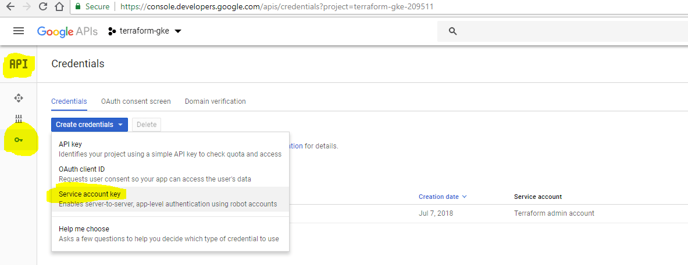

# terraform-gke [](https://travis-ci.org/stefan-caraiman/terraform-gke)

# About:

This repository contains all the necessary code for setting up a kubernetes cluster within Google Kubernetes Engine(GKE).
It also contains a CI pipeline which will validate the terraform code syntax and formatting.

## How to:

* Get the account.json file:



## Initializing Helm server(Tiller) on the Kubernetes cluster

After terraform has created the Kubernetes cluster we need to setup Tiller within our kubernetes cluster as it follows:

```
gcloud container clusters get-credentials terraform-gke-cluster --zone europe-west4-a
kubectl create serviceaccount tiller --namespace kube-system
kubectl create clusterrolebinding tiller --clusterrole cluster-admin --serviceaccount=kube-system:tiller
helm init --service-account tiller
# Check if tiller is running(kube-system being our default namespace)
kubectl get pods -n kube-system
```
# Notes:

* In case the provider does not see the "account.json" local file, try exporting the file location like such: ```export GOOGLE_CREDENTIALS="account.json"```